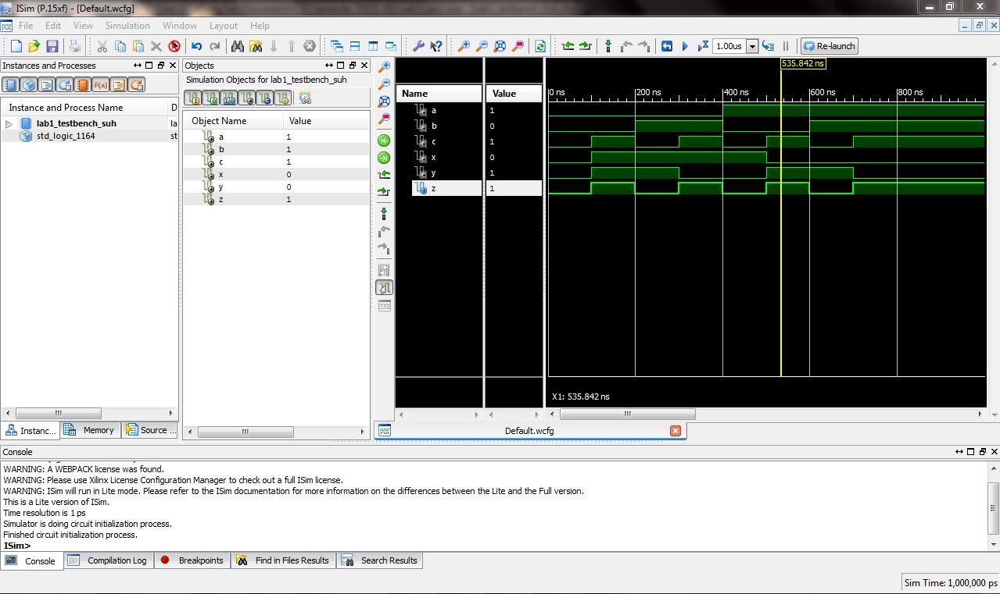
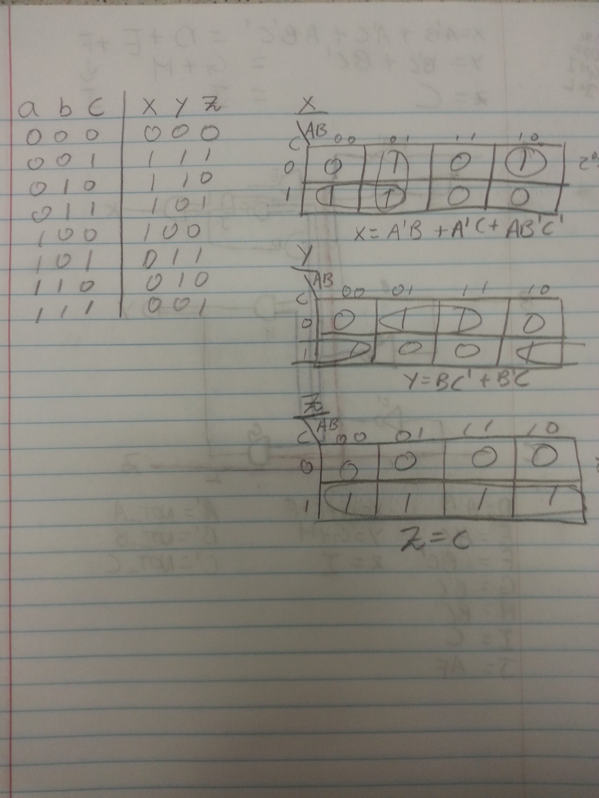

ECE281_Lab1
===========

#truth table screenshot

#K-map screenshot

#ISlim

#Physical Lab
Checked.

#SOP

#VHDL
Uploaded

#Testbench
Uploaded

#explanation of why the waveforms are correct
the wave forms are correct because according to the ISlim picture, and lines go up and down in coordinace with the 1s, and 0s. 

#ucf. File
uploaded.

#Debugging and testing and final schematic
uploaded

#Required functionality of 3-bits
Worked.

#A functionality of 8-bits w/ STD_LOGIC_VECTOR
uploaded into https://github.com/suhsungwoo/ECE281_Lab1_8bit

#tested values
#1) 10101010 - 01010110
#2) 01010101 - 10101011
#3) 01101100 - 10010100
#4) 11011011 - 00100101
#5) 11110000 - 00010000
#6) 00001111 - 11110001
#7) 10001001 - 01110111
#8) 00000001 - 11111111
#9) 00100010 - 11011110
#10) 10100101 - 01011011

#DOCUMENTATION
Got help from Dr. Neebel and Cadet Weisner helped me figure out why my table for 8-bit wasn't working. Cadet Weisner realized in my VHDL I wasn't using the directed IEEE. Dr. Neebel helped me figure out lines 45-47 on VHDL. Which was the main syntax for the whole project. 
